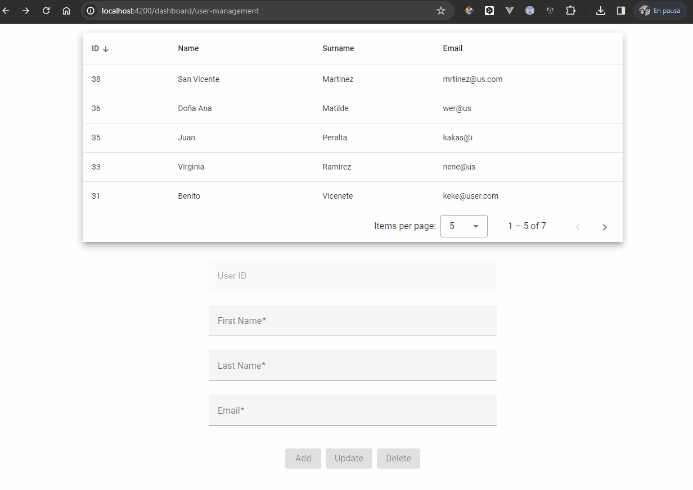

<p align="center">
    
    
    
</p>

## Motivation

This project is a code task for Full Stack Developer, this is the part front-end.

## Demo

<p>
  
</p>

#### Features

- [x] Dashboard Module with page UserManagement
- [x] Error Module with page NotFound
- [x] Standalone components
- [x] NgRx Store
- [x] NgRx Effects
- [x] Tests E2E
- [x] ESLint
- [x] LazyLoad
- [x] Routing

#### Commands

| command                   | What it does?                                 |
| ------------------------- | :-------------------------------------------- |
| `npm start`               | Starts the server in dev mode                 |
| `npm run test`            | Starts the server in test mode                |
| `npm run lint`            | Runs ESLint on project                        |
| `npm run build`           | Build application mode production             |

### Local Development

you can setup a local environment with the following commands:
#### Note: Don't forget to set up project [rindus-backend](https://github.com/SwA91/rindus-backend.git)

```bash
# Clone repo
git clone https://github.com/SwA91/rindus-frontend.git

# Navigate to project directory
cd rindus-frontend

# Install dependencies
npm install

# Build and run local dev server
npm start
```

#### Dependencies

| Package            | What it does?                                                                               | Link                                                   |
| ------------------ | :------------------------------------------------------------------------------------------ | :----------------------------------------------------- |
| `@angular/material` | UI component infrastructure and Material Design components for Angular web applications. | [Here](https://www.npmjs.com/package/@angular/material) |


#### Dev Dependencies

| Package                       | What it does?                                                                                            | Link                                                              |
| ----------------------------- | :------------------------------------------------------------------------------------------------------- | :---------------------------------------------------------------- |
| `tailwindcss`                 | A utility-first CSS framework for rapidly building custom user interfaces.                               | [Here](https://www.npmjs.com/package/tailwindcss)                 |


#### Disclaimer

The Tailwind name and logos are trademarks of Tailwind Labs Inc.
<br>
The Angular and Angular Material name and logos are trademarks of Google.
